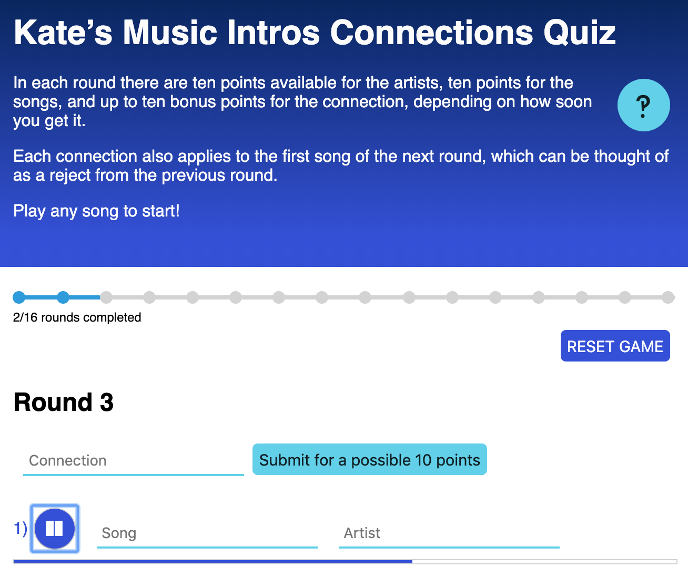

# Kate’s Music Intros Connections Quiz

## What's this then?
I hosted a music intros quiz night once where each round had a connection, which was worth more points if worked out earlier on. This is a digital version of that quiz, with much less cheating and shouting.

## To run locally

1. In the command line, run `git clone git@github.com:KateHoward10/music-connections-quiz.git`
2. Navigate into music-connections-quiz
3. Run `yarn install` or `npm install`
4. Run `yarn start` or `npm start`